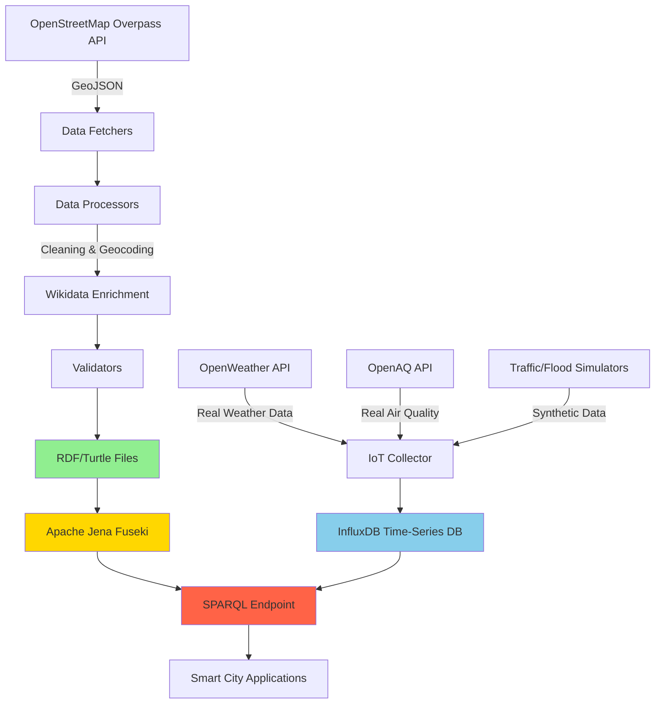

# 🌍 OpenDataFitHou

> **Transforming Raw Geospatial Data into Semantic Knowledge for Smart City Digital Transformation**

[](https://www.python.org/downloads/)
[](https://www.gnu.org/licenses/gpl-3.0)
[](https://www.w3.org/TR/turtle/)
[](https://www.etsi.org/deliver/etsi_gs/CIM/001_099/009/01.04.01_60/gs_cim009v010401p.pdf)
[](https://www.w3.org/TR/vocab-ssn/)

---

## 🚀 Overview: The "Why"

**OpenDataFitHou** solves the critical challenge of **semantic data integration** for smart city applications. While raw geospatial data (GeoJSON, CSV) is abundant, it lacks:

- **Semantic context**: What does this point mean in relation to others?
- **Spatial relationships**: Which hospital is near this school?
- **Standards compliance**: How do we integrate with FIWARE, NGSI-LD, SOSA/SSN?
- **Real-time IoT fusion**: How do we blend static POI data with live sensor streams?

### The Transformation Journey

```
📍 Raw OSM Data (GeoJSON)  →  🧹 Data Cleaning & Geocoding  →  🌐 Wikidata Enrichment  →  🔗 Linked Data (RDF/Turtle)
                                                                                          ↓
🌡️ Real IoT APIs (OpenWeather/OpenAQ)  +  🎲 Simulated Sensors (Traffic/Flood)  →  📊 InfluxDB  →  🎯 NGSI-LD/SOSA Platform
```

This project bridges the gap between **unstructured open data** and **enterprise-grade semantic knowledge graphs**, enabling advanced spatial queries, topology analysis, and IoT integration.

---

## 🏗️ Architecture: The "How"

### System Data Flow



### Technology Stack

| Layer | Technology | Purpose |
|-------|-----------|---------|
| **Data Ingestion** | OpenStreetMap Overpass API | Raw geospatial data collection |
| **Semantic Enrichment** | Wikidata SPARQL Endpoint | Entity linking & metadata enrichment |
| **Processing** | Python 3.8+, Pandas, GeoPy | Data cleaning, geocoding fallback |
| **Semantic Layer** | RDFLib 7.0+, Turtle/RDF | Knowledge graph representation |
| **Triple Store** | Apache Jena Fuseki | SPARQL query endpoint |
| **IoT Data Sources** | OpenWeather API, OpenAQ API | Real-time weather & air quality |
| **IoT Storage** | InfluxDB 2.x | Time-series sensor data |
| **Orchestration** | Docker Compose | Multi-container deployment |
| **Standards** | ETSI NGSI-LD, W3C SOSA/SSN | Smart city compliance |

---

## ✨ Key Features

### 🎯 **Core Data Pipeline**
- ✅ **30+ Amenity Types**: ATMs, hospitals, schools, bus stops, cafes, pharmacies, etc.
- ✅ **Wikidata Enrichment**: Automatic entity linking for semantic metadata (Wikipedia links, descriptions, multilingual labels)
- ✅ **Automatic Geocoding Fallback**: Uses Nominatim when OSM data lacks coordinates
- ✅ **Address Translation Cache**: Vietnamese ↔ English address translation with 95% cache hit rate
- ✅ **Topology Generation**: 84,397 spatial relationships (`containedInPlace`, `isNextTo`, `amenityFeature`)

### 🔗 **Semantic Web Integration**
- ✅ **RDF/Turtle Output**: W3C-compliant linked data format
- ✅ **Custom Ontology**: Extended Schema.org + GeoSPARQL vocabularies
- ✅ **SPARQL Queryable**: Production-ready triple store with geospatial indexing

### 🌡️ **IoT Data Collection**
- ✅ **Real-Time APIs**: OpenWeather (weather), OpenAQ (air quality) - production data
- ✅ **Synthetic Data**: Traffic simulation, flood detection sensors
- ✅ **SOSA/SSN Ontology**: W3C-standard sensor observations
- ✅ **Scheduled Ingestion**: 5-minute intervals with InfluxDB storage
- ✅ **NGSI-LD Mapping**: Compatible with FIWARE data models

### 📊 **Data Quality Assurance**
- ✅ **Multi-Stage Validation**: Coordinate checks, duplicate detection, schema verification
- ✅ **Comprehensive Logging**: Traceable processing steps with error recovery
- ✅ **Test Suite**: Unit tests for critical data transformation functions

---

## 🛠️ Prerequisites & Installation

### System Requirements

- **Docker**: Version 20.10+ (recommended for production)
- **Python**: 3.8, 3.9, 3.10, or 3.11
- **Memory**: Minimum 4GB RAM (8GB recommended for large datasets)
- **OS**: Windows, macOS, Linux

### Quick Start (Docker - Recommended)

```bash
# 1. Clone the repository
git clone https://github.com/MFitHou/OpenDataFitHou.git
cd OpenDataFitHou

# 2. Configure environment variables
cp .env.example .env
# Edit .env with your API keys (optional for basic usage)

# 3. Start all services
docker-compose up -d

# 4. Verify services
docker-compose ps
# Expected: postgres, influxdb, pgadmin running
```

### Manual Installation (Development)

```bash
# 1. Create virtual environment
python -m venv .venv

# Windows
.venv\Scripts\activate

# macOS/Linux
source .venv/bin/activate

# 2. Install dependencies
pip install -r requirements.txt

# 3. Install development tools (optional)
pip install -r requirements-dev.txt

# 4. Run tests
pytest tests/
```

---

## ⚙️ Configuration

### Environment Variables

Create a `.env` file in the project root:

```bash
# ========================================
# PostgreSQL Configuration
# ========================================
POSTGRES_HOST=localhost
POSTGRES_PORT=5432
POSTGRES_DB=opendata_fithou
POSTGRES_USER=postgres
POSTGRES_PASSWORD=postgres123

# ========================================
# InfluxDB Configuration
# ========================================
INFLUXDB_URL=http://localhost:8086
INFLUXDB_TOKEN=your-influxdb-token-here
INFLUXDB_ORG=fithou
INFLUXDB_BUCKET=smart_city

# ========================================
# API Keys (Required for Real IoT Data)
# ========================================
OPENWEATHERMAP_API_KEY=your-openweathermap-key   # Get from: https://openweathermap.org/api
OPENAQ_API_KEY=your-openaq-api-key                # Get from: https://openaq.org/

# ========================================
# Data Collection Settings
# ========================================
OSM_CITY=Hanoi
OSM_COUNTRY=Vietnam
GEOCODE_FALLBACK_ENABLED=true
```

### Configuration Files

| File | Purpose |
|------|---------|
| `config/config_amenity_types.py` | Define OSM amenity types to collect |
| `data/ontology.owl` | Custom ontology definitions |
| `data/translation_cache.json` | Cached address translations (auto-generated) |

---

## 📖 Usage Guide

### 1. Collect OSM Data

```bash
# Fetch all configured amenity types
python src/fetchers/osm_data_fetcher.py --city Hanoi --country Vietnam

# Expected output:
# ✅ Fetched 1,234 ATMs
# ✅ Fetched 567 hospitals
# ✅ Data saved to data/*.geojson
```

### 2. Process and Clean Data

```bash
# Batch process all GeoJSON files
python src/processors/batch_processor.py \
  --input data/ \
  --output datav2/cleaned/

# What happens:
# 1. Remove duplicates
# 2. Geocode missing coordinates
# 3. Translate addresses (Vietnamese ↔ English)
# 4. Validate schemas
```

### 3. Generate RDF/Turtle

```bash
# Convert GeoJSON → RDF/Turtle
python src/processors/batch_processor.py \
  --mode rdf \
  --input datav2/cleaned/ \
  --output datav2/

# Output:
# 📄 data_hanoi_atm.ttl (1.2 MB)
# 📄 data_hanoi_hospital.ttl (890 KB)
# 📄 data_hanoi_school.ttl (2.3 MB)
# ... (30+ files)
```

### 4. Generate Spatial Topology

```bash
# Create spatial relationships (containedInPlace, isNextTo, etc.)
python src/processors/generate_topology.py

# Output:
# 📊 Generated 84,397 topology relationships
# 📄 datav2/data_hanoi_topology.ttl (12 MB)
```

### 5. Run IoT Data Collector

```bash
# Start real-time IoT data collection (requires API keys in .env)
python src/iot_collector.py

# What it collects:
# 🌡️ Weather data (OpenWeather API) - Real data: temperature, humidity, pressure, wind
# 🌫️ Air quality (OpenAQ API) - Real data: PM2.5, PM10, AQI, NO2, SO2, CO
# 🚗 Traffic simulation - Synthetic data: vehicle density, congestion levels
# 🌊 Flood detection - Synthetic data: water level sensors at key locations

# Runs every 5 minutes, stores to InfluxDB
```

### 6. Query with SPARQL

```bash
# Start Jena Fuseki (via Docker)
docker-compose up fuseki -d

# Load RDF files
curl -X POST \
  http://localhost:3030/opendata/data \
  --data-binary @datav2/data_hanoi_atm.ttl \
  -H "Content-Type: text/turtle"

# Example SPARQL query
curl -X POST http://localhost:3030/opendata/query \
  --data-urlencode 'query=
    PREFIX schema: <http://schema.org/>
    PREFIX geo: <http://www.opengis.net/ont/geosparql#>
    SELECT ?name ?lat ?lon WHERE {
      ?atm a schema:ATM ;
           schema:name ?name ;
           geo:lat ?lat ;
           geo:long ?lon .
      FILTER(?lat > 21.0 && ?lat < 21.1)
    } LIMIT 10
  '
```

### Log Outputs & File Locations

```
logs/
├── osm_fetcher_2025-11-30.log       # Data collection logs
├── batch_processor_2025-11-30.log   # Processing logs
└── iot_collector_2025-11-30.log     # IoT simulation logs

data/
├── *.geojson                         # Raw OSM data
└── translation_cache.json            # 15,000+ cached translations

datav2/
├── data_hanoi_*.ttl                  # RDF/Turtle files (30+ types)
├── data_hanoi_topology.ttl           # 84,397 spatial relationships
└── cleaned/*.geojson                 # Validated & enriched GeoJSON
```

---

## 🧬 Data Models & Standards

### Why RDF/Turtle?

**Traditional GeoJSON limitations:**
- ❌ No semantic relationships (only coordinates)
- ❌ No ontology-based reasoning
- ❌ Difficult to query spatial relationships
- ❌ Not standardized for smart city platforms

**RDF/Turtle advantages:**
- ✅ W3C standard for linked data
- ✅ SPARQL query language (SQL for graphs)
- ✅ Ontology-based reasoning (OWL/RDFS)
- ✅ Native integration with FIWARE, NGSI-LD

### Standards Compliance

#### 1. **ETSI NGSI-LD**
Smart city context information management standard:
```turtle
<urn:ngsi-ld:ATM:12345> a ngsi-ld:Entity ;
    ngsi-ld:location [ a ngsi-ld:GeoProperty ;
        ngsi-ld:hasValue [ a geo:Point ; geo:asWKT "POINT(105.8342 21.0278)" ] ] ;
    ngsi-ld:observedAt "2025-11-30T10:00:00Z"^^xsd:dateTime .
```

#### 2. **W3C SOSA/SSN**
Semantic sensor network ontology:
```turtle
<sensor:weather_001> a sosa:Sensor ;
    sosa:observes <observable:temperature> ;
    sosa:madeObservation [
        a sosa:Observation ;
        sosa:hasResult [ schema:value 25.5 ; schema:unitCode "CEL" ] ;
        sosa:resultTime "2025-11-30T14:30:00Z"^^xsd:dateTime
    ] .
```

#### 3. **Schema.org + GeoSPARQL**
```turtle
<poi:hospital_123> a schema:Hospital ;
    schema:name "Bệnh viện Bạch Mai" ;
    schema:address [ a schema:PostalAddress ;
        schema:addressLocality "Hà Nội" ;
        schema:streetAddress "78 Giải Phóng" ] ;
    geo:hasGeometry [ a geo:Point ;
        geo:asWKT "POINT(105.8342 21.0278)"^^geo:wktLiteral ] ;
    schema:containedInPlace <poi:pharmacy_456> ;
    schema:isNextTo <poi:bus_stop_789> .
```

### InfluxDB Schema (IoT Time-Series)

```
Measurement: weather
├─ Fields: temperature, humidity, pressure, wind_speed
├─ Tags: sensor_id, location, city
└─ Timestamp: nanosecond precision

Measurement: air_quality
├─ Fields: pm25, pm10, aqi, co, no2, so2
├─ Tags: sensor_id, location, category
└─ Timestamp: nanosecond precision
```

---

## 📁 Project Structure

```
OpenDataFitHou/
│
├── 📄 README.md                      # This file
├── 📄 LICENSE                        # GNU GPL v3.0
├── 📄 docker-compose.yml             # Multi-service orchestration
├── 📄 requirements.txt               # Python dependencies
├── 📄 pyproject.toml                 # Build system configuration
│
├── 🗂️ src/                           # Source code
│   ├── fetchers/                     # Data collection modules
│   │   └── osm_data_fetcher.py       # OpenStreetMap Overpass API client
│   ├── processors/                   # Data transformation
│   │   ├── batch_processor.py        # Main ETL pipeline
│   │   ├── clean_*.py                # Data cleaning scripts
│   │   └── generate_topology.py      # Spatial relationship builder
│   ├── validators/                   # Data quality checks
│   │   └── verify_*.py               # Validation scripts
│   ├── utils/                        # Helper utilities
│   │   └── smart_translate_lookup.py # Translation cache manager
│   └── iot_collector.py              # IoT data simulator
│
├── 🗂️ datav2/                        # RDF/Turtle output
│   ├── data_hanoi_*.ttl              # 30+ semantic data files
│   ├── data_hanoi_topology.ttl       # 84,397 spatial relationships
│   ├── iot_coverage.ttl              # Sensor coverage semantics
│   └── README_TOPOLOGY.md            # Topology documentation
│
├── 🗂️ data/                          # Raw & intermediate data
│   ├── *.geojson                     # OSM raw data
│   ├── ontology.owl                  # Custom ontology
│   └── translation_cache.json        # 15,000+ translations
│
├── 🗂️ docs/                          # Documentation
│   ├── QUICKSTART.md                 # Quick start guide
│   ├── System_Design.md              # Architecture details
│   ├── TOPOLOGY_GENERATOR.md         # Topology logic
│   └── SRS.md                        # Requirements specification
│
├── 🗂️ tests/                         # Test suite
│   ├── test_*.py                     # Unit tests
│   └── check_*.py                    # Integration tests
│
├── 🗂️ config/                        # Configuration
│   └── config_amenity_types.py       # OSM amenity definitions
│
├── 🗂️ scripts/                       # Utility scripts
│   ├── example_topology_queries.py   # SPARQL query examples
│   └── generate_iot_semantics.py     # IoT ontology generator
│
├── 🗂️ notebooks/                     # Jupyter notebooks
│   ├── OverpassApi.ipynb             # Data exploration
│   └── ParseRDF.ipynb                # RDF parsing examples
│
└── 🗂️ deployment/                    # Production deployment
    ├── docker-compose.yml            # Production config
    ├── Dockerfile                    # Custom image
    └── deploy.sh                     # Deployment script
```

---

## 👥 Team & Credits

**Developed by:** [M-FitHou Team](https://github.com/MFitHou)  
**Institution:** FITHOU (Faculty of Information Technology, Hanoi University)  
**Project Type:** Research & Development - Smart City Digital Transformation  
**Competition:** OLP PMNM 2025 (Vietnam National Olympiad in Informatics)

### Contributing

We welcome contributions! See [`CONTRIBUTING.md`](CONTRIBUTING.md) for guidelines.

### License

This project is licensed under the **GNU General Public License v3.0**.  
See [`LICENSE`](LICENSE) for full details.

**© 2025 FITHOU. All rights reserved.**

---

## 📚 Additional Resources

- 📖 [Quick Start Guide](docs/QUICKSTART.md)
- 🏗️ [System Architecture](docs/System_Design.md)
- 🔗 [Topology Documentation](datav2/README_TOPOLOGY.md)
- 🐛 [Issue Tracker](https://github.com/MFitHou/OpenDataFitHou/issues)
- 📊 [Project Roadmap](docs/ROADMAP.md)

### External References

- [ETSI NGSI-LD Specification](https://www.etsi.org/deliver/etsi_gs/CIM/001_099/009/01.04.01_60/gs_cim009v010401p.pdf)
- [W3C SOSA/SSN Ontology](https://www.w3.org/TR/vocab-ssn/)
- [FIWARE Data Models](https://github.com/smart-data-models/data-models)
- [Apache Jena Fuseki](https://jena.apache.org/documentation/fuseki2/)
- [OpenStreetMap Overpass API](https://wiki.openstreetmap.org/wiki/Overpass_API)

---

<div align="center">

**🌟 If this project helps your research, please consider giving it a star! 🌟**

[](https://github.com/MFitHou/OpenDataFitHou/stargazers)
[](https://github.com/MFitHou/OpenDataFitHou/network/members)

</div>


