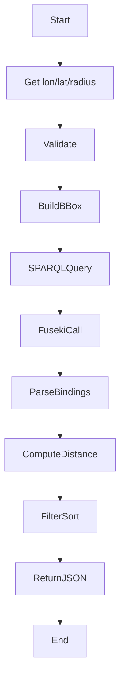
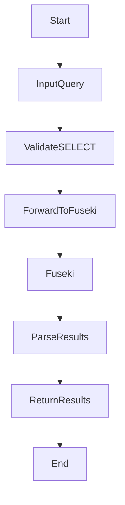
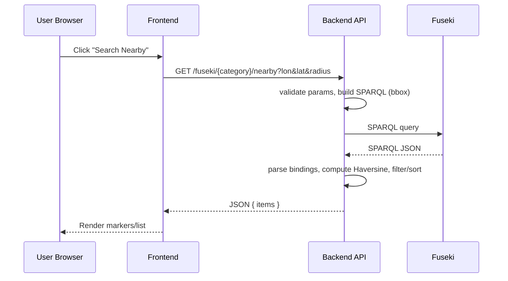
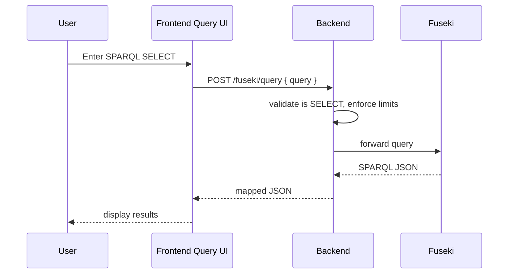

# Phân tích và Thiết kế hệ thống (Software Design Document - SDD)

Phiên bản: 0.1
Ngày: 2025-11-04
Tác giả: (Điền tên)

## 1. Giới thiệu chung

### 1.1 Mục tiêu của tài liệu
- Cung cấp khung thiết kế hệ thống (SDD) cho dự án OpenDataMap theo chuẩn tương đương IEEE 1016.
- Tài liệu hướng dẫn các quyết định kiến trúc, mô tả thành phần, API, dữ liệu RDF, và chỉ dẫn cho triển khai/QA.
- Mục tiêu: cho phép developer/architect/QA nhanh chóng hiểu và triển khai hệ thống.

### 1.2 Phạm vi hệ thống và liên hệ với SRS
- Phạm vi: Hệ thống tra cứu địa điểm/POI, hiển thị bản đồ, thực thi SPARQL, tích hợp Overpass/Wikidata, và hỗ trợ chatbot.
- SRS (System Requirements Specification) là nguồn dữ liệu yêu cầu; SDD này trình bày cách thực hiện các yêu cầu trong SRS (UC-1..UC-6).

### 1.3 Tài liệu tham chiếu
- SRS: `SRS.md` (OpenDataFitHou)
- README/architecture notes in `open_data_backend` and `open_data_map` projects
- Apache Jena Fuseki documentation
- Overpass API docs
- IEEE 1016 SDD guideline (tham khảo)

---

## 2. Kiến trúc tổng thể hệ thống (System Architecture Overview)

### 2.1 Kiến trúc tóm tắt
- Mô hình 3 lớp:
  - Presentation (Frontend): React + Vite + TypeScript, Leaflet (react-leaflet) để hiển thị bản đồ và UI.
  - Application (Backend): NestJS (TypeScript) cung cấp REST API, SPARQL proxy/forwarder, endpoint xử lý nearby search, optional chatbot proxy.
  - Data Layer: RDF triplestore (Apache Jena Fuseki) lưu đồ thị RDF; bên thứ ba: Overpass (OSM) và Wikidata SPARQL.

### 2.2 Sơ đồ kiến trúc (mermaid)

```mermaid
flowchart LR
  subgraph Client
    A[Browser: Map UI / Chat UI / Query UI]
  end
  subgraph Backend
    BAPI[API: open_data_backend]
    BService[FusekiService]
    BProxy[OverpassProxy?]
  end
  subgraph Data
    Fuseki[Apache Jena Fuseki]
    Overpass[Overpass API]
    Wikidata[Wikidata SPARQL]
  end

  A -->|REST / WebSocket| BAPI
  BAPI -->|SPARQL| Fuseki
  BAPI -->|HTTP| Overpass
  BAPI -->|SPARQL| Wikidata
  A -->|Direct (optional)| Overpass
  A -->|Direct (optional)| Wikidata
```

> Ghi chú: sơ đồ trên là bản tóm tắt — có thể chuyển thành PlantUML nếu cần.

### 2.3 Thành phần chính và tương tác
- Frontend (`open_data_map`):
  - `SimpleMap.tsx`: hiển thị markers, outline, xử lý các interaction.
  - `rdfParser.ts`: gom triples → domain objects.
  - `Query.tsx`: giao diện nhập SPARQL (forward to backend).
  - `nearbyApi.ts`: helper gọi `/fuseki/{category}/nearby`.
- Backend (`open_data_backend`):
  - `FusekiController`: REST endpoints: `/fuseki/{category}/nearby`, `POST /fuseki/query` (SELECT only), optional `/overpass/proxy`, optional `/fuseki/export`.
  - `FusekiService`: build SPARQL queries (bounding box), call Fuseki endpoint, parse SPARQL JSON bindings, post-process (Haversine, filtering, sorting).
  - Auth/CORS/middleware: validation, rate-limit, logging.
- Data Layer:
  - Fuseki: chứa turtle files in `opendata_hanoi/`.
  - Overpass/Wikidata: external services for geometry and semantic enrichment.

---

## 3. Phân tích hệ thống (System Analysis)

### 3.1 Use Case analysis (tóm tắt kế thừa từ SRS)
- UC-1: Tìm kiếm tiện ích xung quanh vị trí — input: lon, lat, radiusKm; output: list of POI.
- UC-2: Tra cứu thông tin địa điểm — input: subject identifier; output: triples / metadata / geometry.
- UC-3: Lấy ranh giới hành chính — input: osmRelationId; output: polygon GeoJSON, area.
- UC-4: Truy vấn SPARQL — input: SPARQL SELECT; output: SPARQL JSON mapped.
- UC-5: Tương tác Chatbot — input: natural language; output: textual answer + optional geo actions.
- UC-6: Xuất RDF/XML — input: export request; output: RDF/XML file or stream.

### 3.2 Actor, boundary, data flow (example UC-1)
- Actors: End-user (browser), Backend service, Fuseki, Overpass (optional), Wikidata (optional).
- Boundary: public REST API surface of backend + optional direct external API calls from client (CORS).
- Data flow (UC-1): Browser → Backend `/fuseki/{category}/nearby` → Backend builds SPARQL with bbox → Fuseki returns bindings → Backend parse + Haversine → Backend returns JSON → Browser renders.

### 3.3 Use Case Diagram (mermaid)

```mermaid
usecase
  :User: as U
  rectangle System {
    U --> (Search Nearby)
    U --> (Inspect POI)
    U --> (Export RDF/XML)
    U --> (Chat with Bot)
    (Search Nearby) ..> (Inspect POI)
  }
```

### 3.4 Activity Diagrams
- Activity diagram (UC-1: Search Nearby)



- Activity diagram (UC-4: SPARQL Query)



---

## 4. Thiết kế chi tiết (Detailed Design)

### 4.1 Thiết kế lớp (Class Design) — high-level
- Frontend domain models (TypeScript interfaces):
  - POI {
    id: string;
    label: string;
    geometry: { type: 'Point'|'Polygon', coordinates: [...] };
    properties: Record<string, any>;
  }
  - SearchResult { center: {lon,lat}, radiusKm: number, items: POI[] }
- Backend classes (TypeScript / NestJS):
  - FusekiService
    - methods: runSelect(query), searchNearby(category, lon, lat, radiusKm, limit), parseBindings(bindings)
  - FusekiController
    - endpoints: getNearby(), postQuery()
  - OverpassProxyService (optional)
  - RDFMapper
    - converts SPARQL bindings → domain objects

- Data relationships:
  - POI.properties map to RDF predicates (e.g., rdfs:label, geo:asWKT, schema:image).

### 4.2 Sequence diagrams (mermaid) — examples
- Sequence: Search Nearby (UC-1)



- Sequence: SPARQL Query (UC-4)



### 4.3 Thiết kế cơ sở dữ liệu (RDF Schema / Ontology)
- Mục tiêu: mô tả lớp thực thể dùng trong dataset và các thuộc tính chính.
- Candidate classes (RDFS/OWL style):
  - od:PointOfInterest
  - od:AdministrativeBoundary
  - od:Service (subclass of PointOfInterest) — e.g., ATM, Toilet, Hospital, Playground
- Key properties:
  - rdfs:label (xsd:string)
  - geo:asWKT (literal WKT)
  - geo:lat / geo:long (xsd:double) — optional
  - od:osmRelationId (xsd:integer)
  - schema:image (URI)
  - od:population (xsd:integer)
- Example minimal Turtle snippet (placeholder):

```turtle
@prefix od: <http://opendatamap.local/ontology#> .
@prefix geo: <http://www.opengis.net/ont/geosparql#> .

<http://opendatamap.local/resource/poi/atm1> a od:Service ;
  rdfs:label "ATM ABC" ;
  geo:asWKT "POINT(105.84 21.03)" .
```

> Action item: export a small ontology file (ontology.owl / .ttl) listing classes/properties used.

### 4.4 Thiết kế API (endpoints)
- Overview: API is RESTful; JSON responses. All responses include `requestId` in headers or body for tracing.

1) GET /fuseki/{category}/nearby
- Description: tìm POI theo category quanh center.
- Params (query): `lon` (number, required), `lat` (number, required), `radiusKm` (number, optional, default=1), `limit` (int, optional, default=100)
- Response 200: `{ center:{lon,lat}, radiusKm, count, items:[{id,label,lon,lat,distanceKm,properties}] }`
- Errors: 400 (invalid params), 502 (Fuseki error), 429 (rate limit)

2) POST /fuseki/query
- Description: forward SPARQL SELECT queries only.
- Body: `{ query: "SELECT ..." }`
- Validation: must contain SELECT; length limit; rate-limited.
- Response 200: `{ count, data:[ {col1:val, col2:val, ...} ] }`
- Errors: 400 (non-SELECT), 413 (query too long), 401/502.

3) (Optional) POST /overpass/proxy
- Description: proxy Overpass requests for outlines (auth/rate-limit control).
- Body: `{ query: "relation(<id>); out geom;" }`
- Response: raw Overpass JSON (or normalized `elements` + `geometryStatus`).

4) (Optional) GET /fuseki/export?format=rdfxml&graph=<graph>
- Description: export dataset or graph to RDF/XML (streaming).
- Auth: admin only.

> Note: Provide OpenAPI snippet separately (next step upon request).

---

## 5. Thiết kế giao diện người dùng (UI/UX Design)

### 5.1 Wireframes (textual / placeholder)
- Map page (primary):
  - Top: search bar (text & coords), radius selector, category selector
  - Left panel: results list (sortable by distance), InfoPanel for selected POI
  - Map canvas: markers + clusters, outline layers
  - Bottom-right: Chatbot toggle (drawer)
- Query page:
  - Textarea for SPARQL, Execute button, results table, export button
- Chat panel:
  - Chat messages, quick actions (Show on map, Zoom to), structured responses (geojson attachments)

### 5.2 Nguyên tắc UI
- Responsive and mobile-first.
- Immediate feedback: spinners for long ops, progress for exports.
- Minimal clicks: action buttons in InfoPanel (export, open Wikidata, draw boundary).
- Accessibility: ARIA labels for controls, keyboard navigation for search results.

---

## 6. Thiết kế phi chức năng (Non-Functional Design)

### 6.1 Hiệu năng & Scale
- Latency target: typical nearby query (radius ≤ 5 km, limit ≤ 200) p95 < 3s on staging dataset.
- Max limit cap: `MAX_LIMIT = 2000` (backend enforced).
- Caching: in-memory LRU or Redis for expensive queries (outline fetches, Wikidata results).
- Paging/streaming for large SPARQL results.

### 6.2 Bảo mật
- CORS: frontend origin white-listing.
- Auth: admin endpoints (export) require auth (JWT or API key).
- Rate-limiting: per-IP and per-API-key for `/fuseki/query` and chatbot proxy.
- Input validation and sanitation: prevent SPARQL injection, enforce SELECT-only.
- Secrets: store external API keys in env vars and do not expose to client; use backend proxy for LLM/Overpass if keys are required.

### 6.3 Khả năng sẵn sàng & dự phòng
- Deploy Fuseki as managed service or container with persistent storage and snapshot backups.
- Backend: stateless services behind load balancer; use Redis for cache/session if needed.
- Monitoring/alerts: metrics for query latency, error rates, rate-limit breaches; log requestId for tracing.

### 6.4 Khả năng tích hợp
- OpenAPI spec for backend endpoints.
- Data export (RDF/XML) to integrate with external GIS/semantic systems.

---

## 7. Phụ lục (Appendix)

### 7.1 Component Diagram (placeholder)
- Component list: Frontend components (Map, InfoPanel, Chat), Backend components (API, FusekiService, OverpassProxy), Data services.

### 7.2 Deployment Diagram (placeholder)
- Suggestion: Docker Compose for local dev: services: frontend (vite), backend (node/nest), fuseki; production: k8s manifests with persistent volumes for Fuseki.

### 7.3 Glossary
- POI: Point of Interest
- RDF: Resource Description Framework
- SPARQL: RDF query language
- WKT: Well-known Text (geometry)
- OSM: OpenStreetMap
- LLM: Large Language Model
- API: Application Programming Interface

---

## 8. Next steps / Action items
- Review khung SDD và chỉ định người phụ trách mỗi phần.
- Tạo OpenAPI spec (YAML) cho các endpoint đã nêu.
- Export/complete ontology (`ontology.owl`, `ontology.ttl`) và đính kèm vào repo.
- (Optional) Create test skeletons for backend validators and integration tests with mocked Fuseki.


*Hết tài liệu khung. Điền chi tiết vào từng phần theo yêu cầu dự án.*
